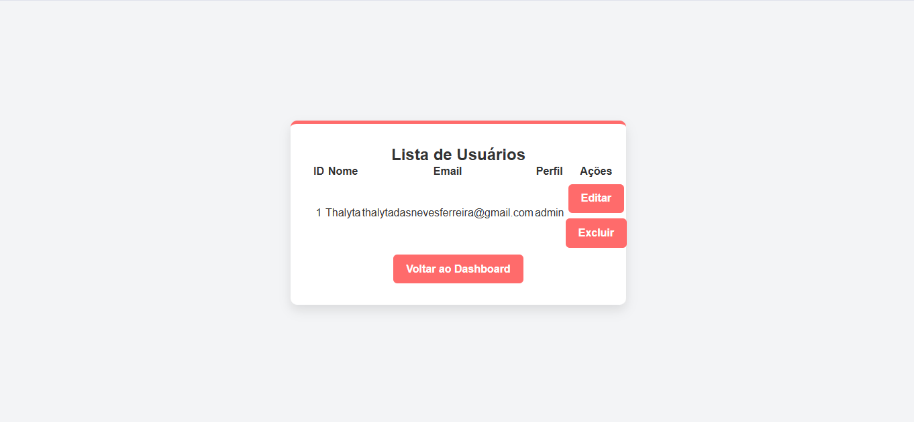

# Projeto - Aplicação de Cadastro e Login

## Índice

[Descrição](#descri%C3%A7%C3%A3o)

[Introdução](#introdu%C3%A7%C3%A3o)

[Funcionalidades](#funcionalidades)

[Tecnologias Utlizadas](#tecnologias-utilizadas)

[Estruturas de Pastas](#estrutura-de-pastas)

[Tela de Login](#tela-de-login)

[Tela de Registro](#tela-de-registro)

[Tela de edição de usuário](#tela-de-edi%C3%A7%C3%A3o-de-usu%C3%A1rio)

[Fontes Consultadas](#fontes-consultadas)

[Autores](#autores)

## Descrição

Este projeto é uma aplicação de cadastro e login de usuários, com foco em três tipos de perfis:

- **Admin**: Controle total do sistema, pode gerenciar outros usuários e dados sensíveis.
- **Gestor**: Responsável por gerenciar sua equipe, com permissões moderadas.
- **Colaborador**: Usuário comum, com permissões restritas.

A aplicação, construída em PHP, possui uma interface estilizada com CSS, permitindo cadastro, login, exclusão e edição de perfis.

## Introdução

Este sistema visa simplificar o gerenciamento de usuários para organizações que possuem diferentes níveis de hierarquia. A interface intuitiva facilita a interação do usuário, permitindo cadastros, logins e edições de perfil de forma eficaz. O documento serve como guia de desenvolvimento e manutenção do projeto.

## Funcionalidades

Atualmente, a aplicação conta com as seguintes funcionalidades:

1. **Cadastro de Usuários**: Os usuários podem se registrar com seus dados, escolhendo entre os perfis Admin, Gestor ou Colaborador.
2. **Login**: Autenticação de usuários por meio de e-mail e senha.
3. **Validação de Formulários**: Validação básica de campos de cadastro e login (ex: e-mail e senha obrigatórios).
4. **Estilização**: Interface estilizada com foco em acessibilidade e cores predominantes (azul e dourado).
5. **Estrutura Incremental**: O projeto será continuamente atualizado para incluir novas funcionalidades.

## Tecnologias Utilizadas

- **PHP**: Linguagem de programação para o back-end.
  

- **HTML5**: Para a estruturação das páginas de login e cadastro.
  

- **CSS3**: Para estilização das interfaces.

  
- **MySQL**: Banco de dados relacional para armazenar informações de usuários.

- **Git/GitHub**: Controle de versão e colaboração no projeto.

  

## Estrutura de Pastas

A organização atual do projeto é a seguinte:

- **views**: Páginas HTML para login e registro.
- **controllers**: Controladores que gerenciam a lógica da aplicação.
- **models**: Conectam a lógica ao banco de dados.
- **_css**: Contém o arquivo `style.css` responsável pela estilização.
- **index.php**: Arquivo principal da aplicação.

### Tela de Login

A página de login está localizada em `views/login.php`, com os seguintes campos:
- **Email**: Input para e-mail do usuário.
- **Senha**: Input para a senha

### Tela de Registro

Localizada em `views/register.php`, permite que o usuário se registre escolhendo entre três perfis:
- **Admin**
- **Gestor**
- **Colaborador**

### Tela de Edição de Usuário 

Localizada em views/edit_user.php, permite a modificação dos dados do usuário, sendo disponível apenas para Admin e Gestor.

## Fontes Consultadas

- Documentação oficial do [PHP](https://www.php.net/docs.php).
- Guia de boas práticas em [HTML5 e CSS3](https://developer.mozilla.org/pt-BR/docs/Web/HTML).
- Exemplos e dicas de projetos similares no [Stack Overflow](https://stackoverflow.com).

## Autores
Thalyta das Neves Ferreira - 3ºA
